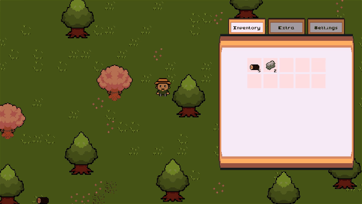
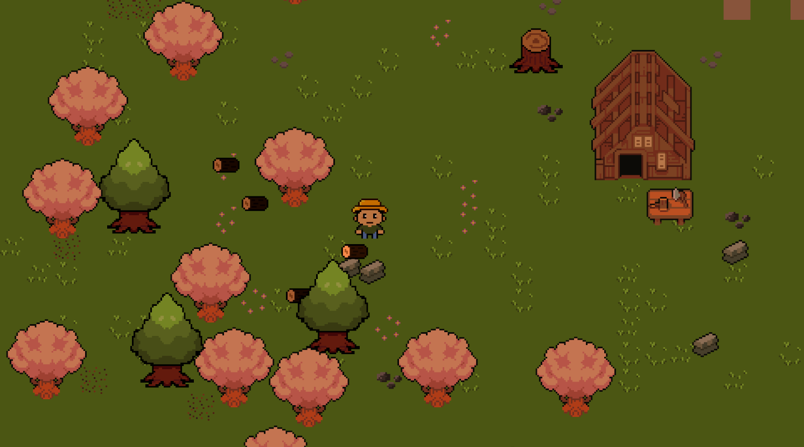
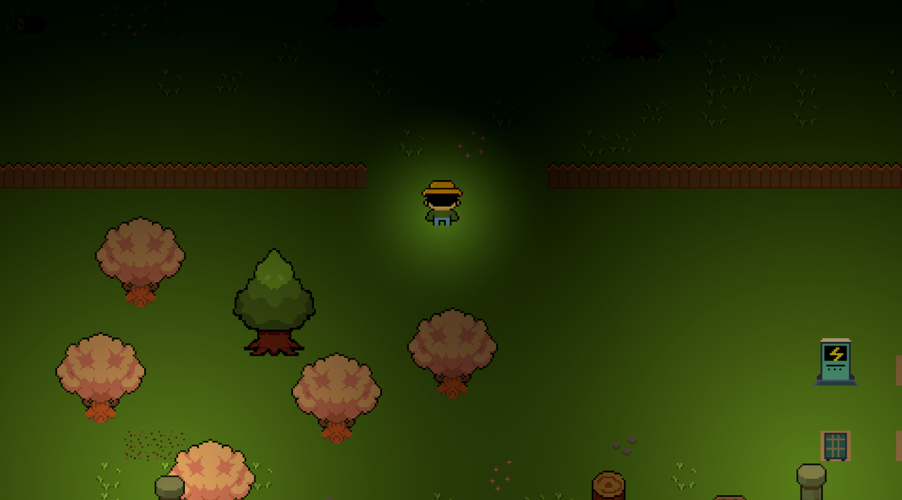
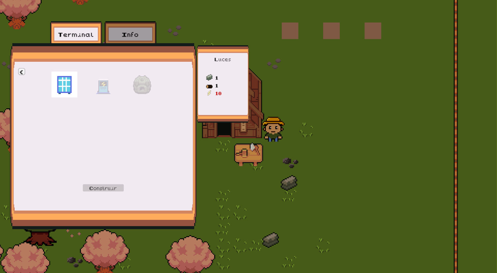
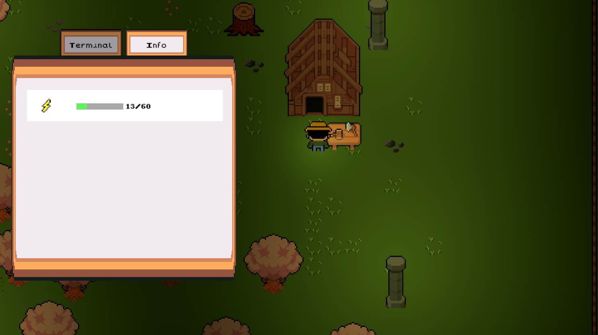

# Unity-TopDownEnergy

A top-down prototype developed in Unity 6000.3.8f1 as a 4-week university project.
Features include an inventory system, energy grid (solar, battery, consumers), day/night cycle, and modular base building.

Players collect resources, construct renewable energy infrastructure, and manage power generation and consumption to keep their base operational.

## Table of Contents

- [Project Overview](#project-overview)
- [Current State](#current-state)
- [Features](#features)
- [Systems](#systems)
- [Screenshots](#screenshots)
- [Future Improvements](#future-improvements)
- [What I Learned](#what-i-learned)
- [Technology Stack](#technology-stack)
- [Credits](#credits)

## Project Overview

**TopDownEnergy** is a 4-week university project designed to explore sustainable energy management through interactive gameplay. Players build and manage renewable energy infrastructure, gather resources, and optimize their base power grid to maintain energy stability.

## Current State

The project is currently a gameplay prototype focused on core systems and architecture rather than final art or content.

## Features

- **Energy Management System**: Dynamically track energy production, consumption, and storage across the base
- **Resource Inventory**: Collect, manage, and spend resources for construction via drag-and-drop inventory mechanics
- **Base Building**: Construct structures on designated slots with real-time validation of resources and energy costs
- **Renewable Energy Structures**: Place energy producers (solar panels, wind turbines) and storage facilities
- **Energy Consumers**: Structures that consume energy while active
- **Player Interaction System**: Interactive base terminals and object interaction feedback
- **UI Management**: Real-time inventory and energy status displays

## Systems

### Core Systems

**Energy Controller** (`BaseManagement/`)
- Central hub for energy production, consumption, and storage
- Tick-based energy simulation (1-second intervals by default)
- Registers and manages all energy producers, consumers, and storage containers
- Prevents energy overflow and handles insufficient power scenarios

**Base Manager** (`BaseManagement/`)
- Manages base slots (building positions) and structure placement
- Validates building requirements (resources + energy costs)
- Controls structure uniqueness constraints
- Handles light post management for visual feedback

**Inventory System** (`InventorySystem/`)
- Slot-based inventory with drag-and-drop UI interaction
- Item data managed via ScriptableObjects
- Tracks resource quantities and validates availability for building
- Interactable highlight system for world items

**Player Controller** (`Player/`)
- Character movement with input normalization
- Facing direction tracking for animations
- Interaction system 
- Player-mounted light system for nighttime visibility

**UI System** (`UI/`)
- Inventory display synchronized with data model
- Real-time energy status visualization
- Menu management and state handling

### Design Patterns

The codebase emphasizes high cohesion and loose coupling, using event-driven communication to reduce direct dependencies between systems.

- **Observer Pattern**: Structural states, inventory changes, and energy deltas emit events. UI elements subscribe to these streams, reducing direct dependencies from logic to presentation.
- **Data-Driven Design (ScriptableObjects)**: Item properties, structural configurations, and construction costs are encapsulated in configuration assets, allowing for rapid balancing without modifying code.
- **Component-Based Architecture**: Separation of concerns (Movement, Input, Animation, etc.)

## Screenshots
### Inventory

### Gameplay
 

### Building Interface

### Energy Interface

## Future Improvements

- **Procedural Generation**: Randomize layouts for replayability
- **Multiple Building Types**: More diverse energy consumers and producers
- **Expanded Inventory**: Equipment upgrades, consumables
- **Save/Load System**: Persistent gameplay state
- **Environmental Feedback**: Weather effects impacting solar/wind production
- **Tutorial System**: Guided introduction for new players

## What I Learned

- **Energy System Design**: Creating balanced, tick-based resource simulation mechanics
- **UI/Data Binding**: Synchronizing UI with gameplay data through events and state-driven updates
- **Inventory Management**: Designing flexible slot-based systems with drag-and-drop interactions
- **Game Architecture**: Building scalable, maintainable systems with clear separation of concerns
- **ScriptableObject Pipeline**: Data-driven design for flexible content creation
- **Input Handling**: Modern Unity Input System usage for responsive controls
- **Game Feel**: How visual feedback (lighting, animations) enhances player experience
- **Time Management**: Delivering a functional project within a 4-week university timeframe

---

## Technology Stack

- Unity 6 (6000.3.8f1)
- C#
- Universal Render Pipeline (URP)
- Unity Input System
- Cinemachine
- TextMeshPro

---

## Credits

### Programming & Systems Design
- Gabriel Guzmán

### Pixel Art & Sprites
- Cynthia Pérez

### Third-Party Assets
- pixel-boy (itch.io, CC0)

---
**Development Time**: 4 weeks