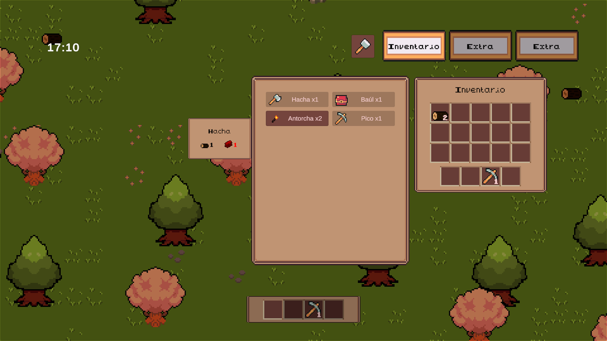
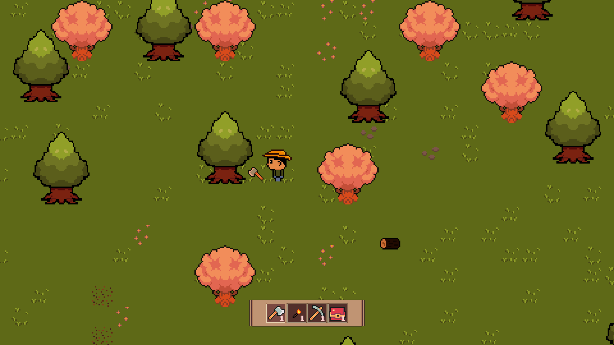
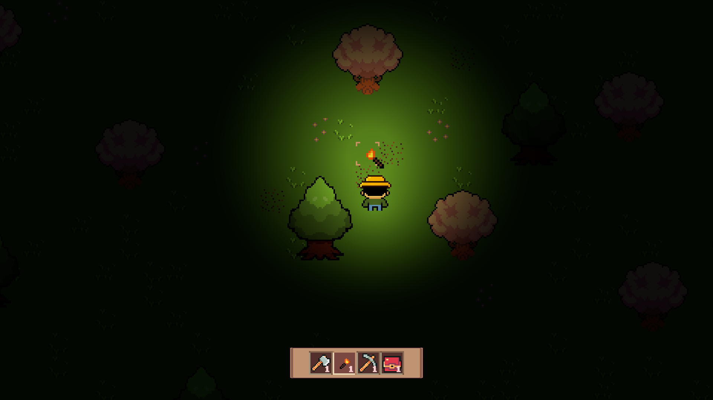
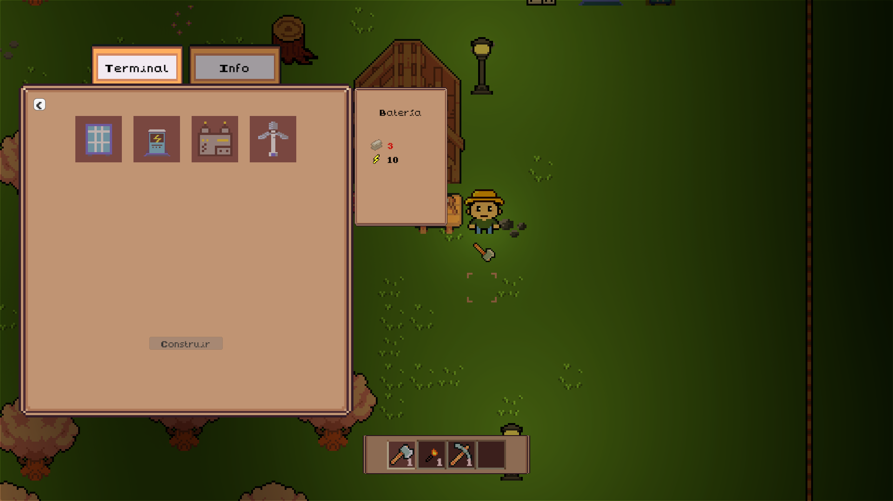
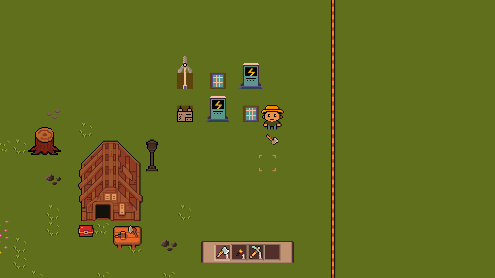

# Unity-TopDownEnergy

A top-down 2D prototype developed in Unity 6000.3.8f1 as a university project.

Features include inventory and storage, crafting, resource gathering, base building, renewable energy production and storage, energy consumers, and a day/night cycle.

## Table of Contents

- [Project Overview](#project-overview)
- [Project Status](#project-status)
- [Features](#features)
- [Systems](#systems)
- [Screenshots](#screenshots)
- [Repository Contents](#repository-contents)
- [What I Learned](#what-i-learned)
- [Technology Stack](#technology-stack)

## Project Overview

**Top Down Energy** is a top-down 2D prototype developed in Unity as a university project. The prototype focuses on combining resource management with renewable energy.

Players explore their environment, gather resources, craft items, construct structures, and manage renewable energy production, storage, and consumption to keep their base powered.

## Project Status

The project is currently paused as a prototype, with a focus on core systems rather than final art or content.

## Features

- **Energy Management**: Track energy production, consumption, and storage across the base

- **Resource Gathering**: Gather resources from environmental resource nodes using different tools

- **Inventory & Storage**: Collect, organize, stack, transfer, and manage items through inventory and storage systems

- **Crafting**: Craft items and tools using gathered resources

- **Base Building**: Construct structures at designated base slots with validation of resource and energy requirements

- **Renewable Energy**: Build and manage solar panels and wind turbines to generate energy, along with batteries for energy storage

- **World Placement**: Place items and placeable objects in the world using grid-based cell selection and occupancy validation

- **Day/Night Cycle**: Dynamic day/night cycle that affects the environment and energy production

- **Player Interaction**: Interact with resource nodes, storage, crafting stations, terminals, and other world objects

- **Hotbar & Equipment**: Select and use tools and placeable items through the hotbar

- **Menus & UI**: Inventory, crafting, building, energy, pause, and main menu interfaces

## Systems

### Core Systems

**Interaction System** (`Player/`)
- Trigger-based detection of nearby interactables via `IInteractable`
- Automatically targets the closest interactable in range
- Provides visual feedback for the current interaction target
- Exposes player systems to interactable objects through a shared `InteractionContext`

**Energy Controller** (`BaseManagement/`)
- Manages energy production, storage, and consumption
- Simulates energy flow at fixed intervals
- Registers and manages all energy producers, consumers, and storage structures
- Handles storage capacity and insufficient energy conditions

**Base Manager** (`BaseManagement/`)
- Manages predefined base building slots
- Validates resource and energy requirements for construction
- Enforces structure uniqueness rules
- Binds to the player inventory on terminal access for building validation
- Emits slot change events on successful builds

**Inventory System** (`InventorySystem/`)
- Slot-based item storage with stacking and drag-and-drop interaction
- Supports item transfer, merging, and slot swapping
- Uses ScriptableObjects for item data
- Provides inventory state to UI through ViewModels
- Integrates with storage, crafting, building, and hotbar systems

**Equipment System** (`InventorySystem/`)

- Tracks the active item selected through the hotbar
- Instantiates and manages held item objects
- Supports tool actions such as resource gathering
- Supports placeable items such as chests and torches
- Updates held item orientation based on player facing direction
- Separates item-specific behavior through the `HeldItem` base class

**Crafting System** (`InventorySystem/`)

- Manages item recipes and crafting requirements
- Validates and consumes required resources
- Supports crafting station-specific recipes
- Adds crafted items to the player's inventory
- Handles inventory overflow by dropping remaining items into the world
- Provides crafting data and state to the UI through ViewModels

**Resource Gathering** (`ToolInteraction/`)

- Supports harvestable resource nodes such as trees and rocks
- Uses reusable health and damage components
- Restricts resource nodes to compatible tools such as the axe and pickaxe
- Spawns gathered resources into valid world positions when a node is depleted

**World Placement** (`Grid/`)

- Provides grid-based world positioning and occupancy validation
- Supports dropping resources and items into valid grid cells
- Supports player-directed placement of placeable objects such as chests and torches
- Handles occupied cells by finding nearby valid positions for dropped item debris
- Shares target cell information between placement and grid highlighting systems

**Player** (`Player/`)
- Handles player input and movement
- Tracks facing direction for player animation and item orientation
- Coordinates player interaction requests
- Provides a player-mounted light for nighttime visibility

**UI System** (`UI/`)
- Inventory, storage, crafting, building, and energy interfaces
- Main menu and pause menu management
- UI state synchronized with gameplay systems through ViewModels and events
- Reusable UI animation through `UIAnimator`

### Design Patterns

The project uses several patterns and design principles to keep gameplay systems modular and reduce unnecessary coupling.

- **Observer Pattern**: Systems expose events for state changes such as inventory updates, energy changes, item selection, and UI state changes. Other systems can subscribe and respond to these events, reducing direct dependencies between systems.

- **Data-Driven Design**: ScriptableObjects are used to define item data, recipes, structures, and construction requirements, allowing gameplay data to be configured independently of system logic.

- **ViewModel-Based UI**: ViewModels act as a bridge between gameplay systems and UI controllers, allowing UI elements to receive presentation-ready data without directly depending on underlying gameplay logic.

- **Composition & Single Responsibility**: Functionality is divided into focused components such as movement, input, animation, interaction and damage handling rather than being concentrated in large monolithic classes.

- **Interfaces**: Interfaces such as `IInteractable` and `IStructure` provide common contracts between systems and allow different objects to be handled through shared abstractions.

## Screenshots
### Inventory & Crafting

### Gameplay
 

### Building Interface

### Built Structures

## Repository Contents

This repository serves as a showcase of the project's implementation and development work.

It contains the project's C# scripts and selected screenshots. Unity project files and playable builds are not included.

## What I Learned

- **UI & Data Binding**: Connecting gameplay data to UI through ViewModels, events, and state-driven updates
- **Inventory & Item Systems**: Designing flexible inventory, storage, crafting, hotbar, and item interaction systems
- **System Design**: Breaking gameplay functionality into focused, reusable components with clear responsibilities
- **Event-Driven Communication**: Using events to allow systems to respond to state changes while reducing unnecessary coupling
- **ScriptableObject Pipeline**: Using data-driven design to separate configurable gameplay data from system logic
- **Input Handling**: Working with Unity's Input System to manage gameplay and interaction

---

## Technology Stack

- Unity 6 (6000.3.8f1)
- C#
- Universal Render Pipeline (URP)
- Unity Input System
- Cinemachine
- TextMeshPro

---
**Development Time**: ~12 weeks